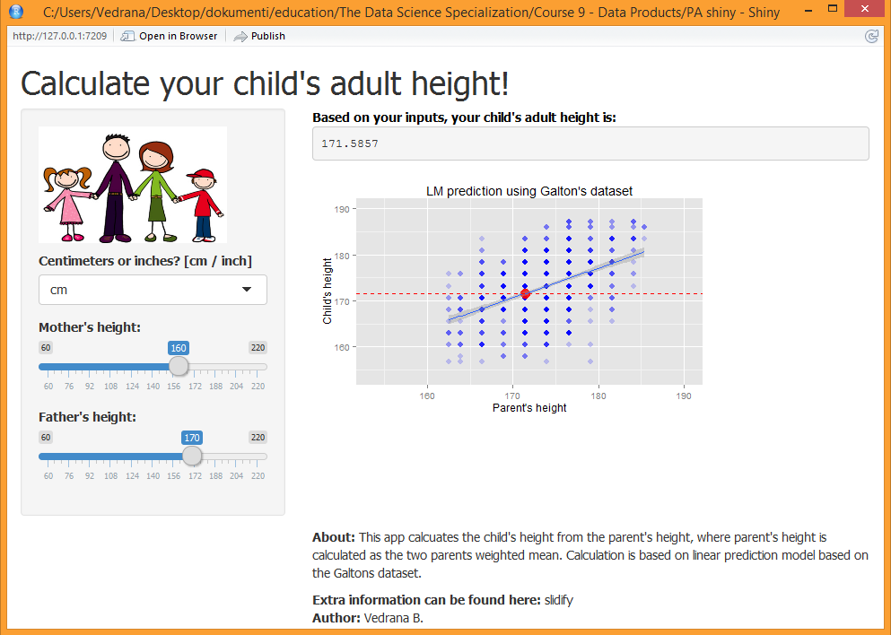

## Predict your child's adult height

Vedrana B.

The Data Science Specialization: Developing Data Products


---

### PROJECT OVERVIEW

- Problem description: 
  
  - predict a child's adult height based on parent's heights

<p> &nbsp </p>

- Problem solution:

  - using existing Galton's dataset (1885 study)
  
      - heights of 928 children and their 205 parents (in inches)
    
      - parents represented by midparent height: 
    
          $\qquad \qquad hParent = \frac{hFather + 1.08*hMother}{2}$
      
  - linear model fit on the Galton's dataset:
  
          $\qquad \qquad \qquad hChild = \alpha * hParent + \beta$
  
  - SHINY application available online

---

### GALTON Dataset preview 

```{r locate, echo=FALSE}
setwd("C:/Users/Vedrana/Desktop/dokumenti/education/The Data Science Specialization/Course 9 - Data Products/MyFirstSlidfy/")
```

```{r graph1, results = 'asis', message = FALSE}
# Chunk of R code for plotting interactive rCharts scatterplot
library(UsingR); require(base64enc); require(rCharts)
data(galton)
options(RCHART_WIDTH = 600, RCHART_HEIGHT = 300)
knitr::opts_chunk$set(comment = NA, results = 'asis', tidy = F, message = T)

g1 <- nPlot(child ~ parent, data = galton, type = 'scatterChart')
g1$show('inline', include_assets = TRUE)
```

---

### Linear prediction model (LM)

- Linear relationship between input variable (parent height) and the output (child height)

```{r code, fig.height = 3, fig.width = 4, eval=FALSE}
# Chunk of R code for building the LM model and for predicting:
model <- lm(formula = child ~ parent, data = galton2)
p     <- (as.numeric(input$hF) + 1.08*as.numeric(input$hM))/2
c     <- predict(model, data.frame(parent = p))
```


```{r plot2, fig.height = 2.5, fig.width = 4}
# Chunk of R code for ploting the linear fit to the Galton data (inches):
library(ggplot2)
limits <- c(min(galton)-1,max(galton)+1)
ggplot(data = galton, aes(x=parent,y=child)) + 
    geom_point(color = "red", alpha=0.2, size=3) + geom_smooth(method='lm')  +
    labs(x = "Parent\'s height", y = "Child\'s height", title ="LM prediction using Galton\'s dataset") + 
    coord_cartesian(xlim = limits, ylim = limits) + guides(color = FALSE, fill = FALSE)
```

---

### Interactive SHINY web app


- Available at: http://vedra.shinyapps.io/PAshiny/


<p> &nbsp </p>

### REFERENCES


- Materials on LMP, Shiny, Slidify etc: www.coursera.com

- Data info: http://www.math.uah.edu/stat/data/Galton.html

- Image source: www.pixshark.com

- Full slidify: www.vedra.github.io/DDPSlidifyFull/index.html

---
