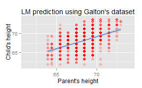

## Predict your child's adult height

Vedrana B.

The Data Science Specialization: Developing Data Products


---

### PROJECT OVERVIEW

- Problem description: 
  
  - predict a child's adult height based on parent's heights

<p> &nbsp </p>

- Problem solution:

  - using existing Galton's dataset (1885 study)
  
      - heights of 928 children and their 205 parents (in inches)
    
      - parents represented by midparent height: 
    
          $\qquad \qquad hParent = \frac{hFather + 1.08*hMother}{2}$
      
  - linear model fit on the Galton's dataset:
  
          $\qquad \qquad \qquad hChild = \alpha * hParent + \beta$
  
  - SHINY application available online

---

### GALTON Dataset preview 


```r
# Chunk of R code for plotting interactive rCharts scatterplot
library(UsingR); require(base64enc); require(rCharts)
data(galton)
options(RCHART_WIDTH = 600, RCHART_HEIGHT = 300)
knitr::opts_chunk$set(comment = NA, results = 'asis', tidy = F, message = T)

g1 <- nPlot(child ~ parent, data = galton, type = 'scatterChart')
g1$show('inline', include_assets = TRUE)
```

<link rel='stylesheet' href=C:/Users/Vedrana/Documents/R/win-library/3.2/rCharts/libraries/nvd3/css/nv.d3.css>
<link rel='stylesheet' href=C:/Users/Vedrana/Documents/R/win-library/3.2/rCharts/libraries/nvd3/css/rNVD3.css>
<script type='text/javascript' src=C:/Users/Vedrana/Documents/R/win-library/3.2/rCharts/libraries/nvd3/js/jquery-1.8.2.min.js></script>
<script type='text/javascript' src=C:/Users/Vedrana/Documents/R/win-library/3.2/rCharts/libraries/nvd3/js/d3.v3.min.js></script>
<script type='text/javascript' src=C:/Users/Vedrana/Documents/R/win-library/3.2/rCharts/libraries/nvd3/js/nv.d3.min-new.js></script>
<script type='text/javascript' src=C:/Users/Vedrana/Documents/R/win-library/3.2/rCharts/libraries/nvd3/js/fisheye.js></script> 
 <style>
  .rChart {
    display: block;
    margin-left: auto; 
    margin-right: auto;
    width: 600px;
    height: 300px;
  }  
  </style>
<div id = 'chart151464a01ab3' class = 'rChart nvd3'></div>
<script type='text/javascript'>
 $(document).ready(function(){
      drawchart151464a01ab3()
    });
    function drawchart151464a01ab3(){  
      var opts = {
 "dom": "chart151464a01ab3",
"width":    600,
"height":    300,
"x": "parent",
"y": "child",
"type": "scatterChart",
"id": "chart151464a01ab3" 
},
        data = [
 {
 "child":           61.7,
"parent":           70.5 
},
{
 "child":           61.7,
"parent":           68.5 
},
{
 "child":           61.7,
"parent":           65.5 
},
{
 "child":           61.7,
"parent":           64.5 
},
{
 "child":           61.7,
"parent":             64 
},
{
 "child":           62.2,
"parent":           67.5 
},
{
 "child":           62.2,
"parent":           67.5 
},
{
 "child":           62.2,
"parent":           67.5 
},
{
 "child":           62.2,
"parent":           66.5 
},
{
 "child":           62.2,
"parent":           66.5 
},
{
 "child":           62.2,
"parent":           66.5 
},
{
 "child":           62.2,
"parent":           64.5 
},
{
 "child":           63.2,
"parent":           70.5 
},
{
 "child":           63.2,
"parent":           69.5 
},
{
 "child":           63.2,
"parent":           68.5 
},
{
 "child":           63.2,
"parent":           68.5 
},
{
 "child":           63.2,
"parent":           68.5 
},
{
 "child":           63.2,
"parent":           68.5 
},
{
 "child":           63.2,
"parent":           68.5 
},
{
 "child":           63.2,
"parent":           68.5 
},
{
 "child":           63.2,
"parent":           68.5 
},
{
 "child":           63.2,
"parent":           67.5 
},
{
 "child":           63.2,
"parent":           67.5 
},
{
 "child":           63.2,
"parent":           67.5 
},
{
 "child":           63.2,
"parent":           67.5 
},
{
 "child":           63.2,
"parent":           67.5 
},
{
 "child":           63.2,
"parent":           66.5 
},
{
 "child":           63.2,
"parent":           66.5 
},
{
 "child":           63.2,
"parent":           66.5 
},
{
 "child":           63.2,
"parent":           65.5 
},
{
 "child":           63.2,
"parent":           65.5 
},
{
 "child":           63.2,
"parent":           65.5 
},
{
 "child":           63.2,
"parent":           65.5 
},
{
 "child":           63.2,
"parent":           65.5 
},
{
 "child":           63.2,
"parent":           65.5 
},
{
 "child":           63.2,
"parent":           65.5 
},
{
 "child":           63.2,
"parent":           65.5 
},
{
 "child":           63.2,
"parent":           65.5 
},
{
 "child":           63.2,
"parent":           64.5 
},
{
 "child":           63.2,
"parent":           64.5 
},
{
 "child":           63.2,
"parent":           64.5 
},
{
 "child":           63.2,
"parent":           64.5 
},
{
 "child":           63.2,
"parent":             64 
},
{
 "child":           63.2,
"parent":             64 
},
{
 "child":           64.2,
"parent":           69.5 
},
{
 "child":           64.2,
"parent":           69.5 
},
{
 "child":           64.2,
"parent":           69.5 
},
{
 "child":           64.2,
"parent":           69.5 
},
{
 "child":           64.2,
"parent":           69.5 
},
{
 "child":           64.2,
"parent":           69.5 
},
{
 "child":           64.2,
"parent":           69.5 
},
{
 "child":           64.2,
"parent":           69.5 
},
{
 "child":           64.2,
"parent":           69.5 
},
{
 "child":           64.2,
"parent":           69.5 
},
{
 "child":           64.2,
"parent":           69.5 
},
{
 "child":           64.2,
"parent":           69.5 
},
{
 "child":           64.2,
"parent":           69.5 
},
{
 "child":           64.2,
"parent":           69.5 
},
{
 "child":           64.2,
"parent":           69.5 
},
{
 "child":           64.2,
"parent":           69.5 
},
{
 "child":           64.2,
"parent":           68.5 
},
{
 "child":           64.2,
"parent":           68.5 
},
{
 "child":           64.2,
"parent":           68.5 
},
{
 "child":           64.2,
"parent":           68.5 
},
{
 "child":           64.2,
"parent":           68.5 
},
{
 "child":           64.2,
"parent":           68.5 
},
{
 "child":           64.2,
"parent":           68.5 
},
{
 "child":           64.2,
"parent":           68.5 
},
{
 "child":           64.2,
"parent":           68.5 
},
{
 "child":           64.2,
"parent":           68.5 
},
{
 "child":           64.2,
"parent":           68.5 
},
{
 "child":           64.2,
"parent":           67.5 
},
{
 "child":           64.2,
"parent":           67.5 
},
{
 "child":           64.2,
"parent":           67.5 
},
{
 "child":           64.2,
"parent":           67.5 
},
{
 "child":           64.2,
"parent":           67.5 
},
{
 "child":           64.2,
"parent":           67.5 
},
{
 "child":           64.2,
"parent":           67.5 
},
{
 "child":           64.2,
"parent":           67.5 
},
{
 "child":           64.2,
"parent":           67.5 
},
{
 "child":           64.2,
"parent":           67.5 
},
{
 "child":           64.2,
"parent":           67.5 
},
{
 "child":           64.2,
"parent":           67.5 
},
{
 "child":           64.2,
"parent":           67.5 
},
{
 "child":           64.2,
"parent":           67.5 
},
{
 "child":           64.2,
"parent":           66.5 
},
{
 "child":           64.2,
"parent":           66.5 
},
{
 "child":           64.2,
"parent":           66.5 
},
{
 "child":           64.2,
"parent":           66.5 
},
{
 "child":           64.2,
"parent":           66.5 
},
{
 "child":           64.2,
"parent":           65.5 
},
{
 "child":           64.2,
"parent":           65.5 
},
{
 "child":           64.2,
"parent":           65.5 
},
{
 "child":           64.2,
"parent":           65.5 
},
{
 "child":           64.2,
"parent":           65.5 
},
{
 "child":           64.2,
"parent":           64.5 
},
{
 "child":           64.2,
"parent":           64.5 
},
{
 "child":           64.2,
"parent":           64.5 
},
{
 "child":           64.2,
"parent":           64.5 
},
{
 "child":           64.2,
"parent":             64 
},
{
 "child":           64.2,
"parent":             64 
},
{
 "child":           64.2,
"parent":             64 
},
{
 "child":           64.2,
"parent":             64 
},
{
 "child":           65.2,
"parent":           71.5 
},
{
 "child":           65.2,
"parent":           70.5 
},
{
 "child":           65.2,
"parent":           69.5 
},
{
 "child":           65.2,
"parent":           69.5 
},
{
 "child":           65.2,
"parent":           69.5 
},
{
 "child":           65.2,
"parent":           69.5 
},
{
 "child":           65.2,
"parent":           68.5 
},
{
 "child":           65.2,
"parent":           68.5 
},
{
 "child":           65.2,
"parent":           68.5 
},
{
 "child":           65.2,
"parent":           68.5 
},
{
 "child":           65.2,
"parent":           68.5 
},
{
 "child":           65.2,
"parent":           68.5 
},
{
 "child":           65.2,
"parent":           68.5 
},
{
 "child":           65.2,
"parent":           68.5 
},
{
 "child":           65.2,
"parent":           68.5 
},
{
 "child":           65.2,
"parent":           68.5 
},
{
 "child":           65.2,
"parent":           68.5 
},
{
 "child":           65.2,
"parent":           68.5 
},
{
 "child":           65.2,
"parent":           68.5 
},
{
 "child":           65.2,
"parent":           68.5 
},
{
 "child":           65.2,
"parent":           68.5 
},
{
 "child":           65.2,
"parent":           68.5 
},
{
 "child":           65.2,
"parent":           67.5 
},
{
 "child":           65.2,
"parent":           67.5 
},
{
 "child":           65.2,
"parent":           67.5 
},
{
 "child":           65.2,
"parent":           67.5 
},
{
 "child":           65.2,
"parent":           67.5 
},
{
 "child":           65.2,
"parent":           67.5 
},
{
 "child":           65.2,
"parent":           67.5 
},
{
 "child":           65.2,
"parent":           67.5 
},
{
 "child":           65.2,
"parent":           67.5 
},
{
 "child":           65.2,
"parent":           67.5 
},
{
 "child":           65.2,
"parent":           67.5 
},
{
 "child":           65.2,
"parent":           67.5 
},
{
 "child":           65.2,
"parent":           67.5 
},
{
 "child":           65.2,
"parent":           67.5 
},
{
 "child":           65.2,
"parent":           67.5 
},
{
 "child":           65.2,
"parent":           66.5 
},
{
 "child":           65.2,
"parent":           66.5 
},
{
 "child":           65.2,
"parent":           65.5 
},
{
 "child":           65.2,
"parent":           65.5 
},
{
 "child":           65.2,
"parent":           65.5 
},
{
 "child":           65.2,
"parent":           65.5 
},
{
 "child":           65.2,
"parent":           65.5 
},
{
 "child":           65.2,
"parent":           65.5 
},
{
 "child":           65.2,
"parent":           65.5 
},
{
 "child":           65.2,
"parent":           64.5 
},
{
 "child":           65.2,
"parent":             64 
},
{
 "child":           66.2,
"parent":           71.5 
},
{
 "child":           66.2,
"parent":           71.5 
},
{
 "child":           66.2,
"parent":           71.5 
},
{
 "child":           66.2,
"parent":           70.5 
},
{
 "child":           66.2,
"parent":           69.5 
},
{
 "child":           66.2,
"parent":           69.5 
},
{
 "child":           66.2,
"parent":           69.5 
},
{
 "child":           66.2,
"parent":           69.5 
},
{
 "child":           66.2,
"parent":           69.5 
},
{
 "child":           66.2,
"parent":           69.5 
},
{
 "child":           66.2,
"parent":           69.5 
},
{
 "child":           66.2,
"parent":           69.5 
},
{
 "child":           66.2,
"parent":           69.5 
},
{
 "child":           66.2,
"parent":           69.5 
},
{
 "child":           66.2,
"parent":           69.5 
},
{
 "child":           66.2,
"parent":           69.5 
},
{
 "child":           66.2,
"parent":           69.5 
},
{
 "child":           66.2,
"parent":           69.5 
},
{
 "child":           66.2,
"parent":           69.5 
},
{
 "child":           66.2,
"parent":           69.5 
},
{
 "child":           66.2,
"parent":           69.5 
},
{
 "child":           66.2,
"parent":           68.5 
},
{
 "child":           66.2,
"parent":           68.5 
},
{
 "child":           66.2,
"parent":           68.5 
},
{
 "child":           66.2,
"parent":           68.5 
},
{
 "child":           66.2,
"parent":           68.5 
},
{
 "child":           66.2,
"parent":           68.5 
},
{
 "child":           66.2,
"parent":           68.5 
},
{
 "child":           66.2,
"parent":           68.5 
},
{
 "child":           66.2,
"parent":           68.5 
},
{
 "child":           66.2,
"parent":           68.5 
},
{
 "child":           66.2,
"parent":           68.5 
},
{
 "child":           66.2,
"parent":           68.5 
},
{
 "child":           66.2,
"parent":           68.5 
},
{
 "child":           66.2,
"parent":           68.5 
},
{
 "child":           66.2,
"parent":           68.5 
},
{
 "child":           66.2,
"parent":           68.5 
},
{
 "child":           66.2,
"parent":           68.5 
},
{
 "child":           66.2,
"parent":           68.5 
},
{
 "child":           66.2,
"parent":           68.5 
},
{
 "child":           66.2,
"parent":           68.5 
},
{
 "child":           66.2,
"parent":           68.5 
},
{
 "child":           66.2,
"parent":           68.5 
},
{
 "child":           66.2,
"parent":           68.5 
},
{
 "child":           66.2,
"parent":           68.5 
},
{
 "child":           66.2,
"parent":           68.5 
},
{
 "child":           66.2,
"parent":           67.5 
},
{
 "child":           66.2,
"parent":           67.5 
},
{
 "child":           66.2,
"parent":           67.5 
},
{
 "child":           66.2,
"parent":           67.5 
},
{
 "child":           66.2,
"parent":           67.5 
},
{
 "child":           66.2,
"parent":           67.5 
},
{
 "child":           66.2,
"parent":           67.5 
},
{
 "child":           66.2,
"parent":           67.5 
},
{
 "child":           66.2,
"parent":           67.5 
},
{
 "child":           66.2,
"parent":           67.5 
},
{
 "child":           66.2,
"parent":           67.5 
},
{
 "child":           66.2,
"parent":           67.5 
},
{
 "child":           66.2,
"parent":           67.5 
},
{
 "child":           66.2,
"parent":           67.5 
},
{
 "child":           66.2,
"parent":           67.5 
},
{
 "child":           66.2,
"parent":           67.5 
},
{
 "child":           66.2,
"parent":           67.5 
},
{
 "child":           66.2,
"parent":           67.5 
},
{
 "child":           66.2,
"parent":           67.5 
},
{
 "child":           66.2,
"parent":           67.5 
},
{
 "child":           66.2,
"parent":           67.5 
},
{
 "child":           66.2,
"parent":           67.5 
},
{
 "child":           66.2,
"parent":           67.5 
},
{
 "child":           66.2,
"parent":           67.5 
},
{
 "child":           66.2,
"parent":           67.5 
},
{
 "child":           66.2,
"parent":           67.5 
},
{
 "child":           66.2,
"parent":           67.5 
},
{
 "child":           66.2,
"parent":           67.5 
},
{
 "child":           66.2,
"parent":           67.5 
},
{
 "child":           66.2,
"parent":           67.5 
},
{
 "child":           66.2,
"parent":           67.5 
},
{
 "child":           66.2,
"parent":           67.5 
},
{
 "child":           66.2,
"parent":           67.5 
},
{
 "child":           66.2,
"parent":           67.5 
},
{
 "child":           66.2,
"parent":           67.5 
},
{
 "child":           66.2,
"parent":           67.5 
},
{
 "child":           66.2,
"parent":           66.5 
},
{
 "child":           66.2,
"parent":           66.5 
},
{
 "child":           66.2,
"parent":           66.5 
},
{
 "child":           66.2,
"parent":           66.5 
},
{
 "child":           66.2,
"parent":           66.5 
},
{
 "child":           66.2,
"parent":           66.5 
},
{
 "child":           66.2,
"parent":           66.5 
},
{
 "child":           66.2,
"parent":           66.5 
},
{
 "child":           66.2,
"parent":           66.5 
},
{
 "child":           66.2,
"parent":           66.5 
},
{
 "child":           66.2,
"parent":           66.5 
},
{
 "child":           66.2,
"parent":           66.5 
},
{
 "child":           66.2,
"parent":           66.5 
},
{
 "child":           66.2,
"parent":           66.5 
},
{
 "child":           66.2,
"parent":           66.5 
},
{
 "child":           66.2,
"parent":           66.5 
},
{
 "child":           66.2,
"parent":           66.5 
},
{
 "child":           66.2,
"parent":           65.5 
},
{
 "child":           66.2,
"parent":           65.5 
},
{
 "child":           66.2,
"parent":           65.5 
},
{
 "child":           66.2,
"parent":           65.5 
},
{
 "child":           66.2,
"parent":           65.5 
},
{
 "child":           66.2,
"parent":           65.5 
},
{
 "child":           66.2,
"parent":           65.5 
},
{
 "child":           66.2,
"parent":           65.5 
},
{
 "child":           66.2,
"parent":           65.5 
},
{
 "child":           66.2,
"parent":           65.5 
},
{
 "child":           66.2,
"parent":           65.5 
},
{
 "child":           66.2,
"parent":           64.5 
},
{
 "child":           66.2,
"parent":           64.5 
},
{
 "child":           66.2,
"parent":           64.5 
},
{
 "child":           66.2,
"parent":           64.5 
},
{
 "child":           66.2,
"parent":           64.5 
},
{
 "child":           66.2,
"parent":             64 
},
{
 "child":           66.2,
"parent":             64 
},
{
 "child":           67.2,
"parent":           71.5 
},
{
 "child":           67.2,
"parent":           71.5 
},
{
 "child":           67.2,
"parent":           71.5 
},
{
 "child":           67.2,
"parent":           71.5 
},
{
 "child":           67.2,
"parent":           70.5 
},
{
 "child":           67.2,
"parent":           70.5 
},
{
 "child":           67.2,
"parent":           70.5 
},
{
 "child":           67.2,
"parent":           69.5 
},
{
 "child":           67.2,
"parent":           69.5 
},
{
 "child":           67.2,
"parent":           69.5 
},
{
 "child":           67.2,
"parent":           69.5 
},
{
 "child":           67.2,
"parent":           69.5 
},
{
 "child":           67.2,
"parent":           69.5 
},
{
 "child":           67.2,
"parent":           69.5 
},
{
 "child":           67.2,
"parent":           69.5 
},
{
 "child":           67.2,
"parent":           69.5 
},
{
 "child":           67.2,
"parent":           69.5 
},
{
 "child":           67.2,
"parent":           69.5 
},
{
 "child":           67.2,
"parent":           69.5 
},
{
 "child":           67.2,
"parent":           69.5 
},
{
 "child":           67.2,
"parent":           69.5 
},
{
 "child":           67.2,
"parent":           69.5 
},
{
 "child":           67.2,
"parent":           69.5 
},
{
 "child":           67.2,
"parent":           69.5 
},
{
 "child":           67.2,
"parent":           69.5 
},
{
 "child":           67.2,
"parent":           69.5 
},
{
 "child":           67.2,
"parent":           69.5 
},
{
 "child":           67.2,
"parent":           69.5 
},
{
 "child":           67.2,
"parent":           69.5 
},
{
 "child":           67.2,
"parent":           69.5 
},
{
 "child":           67.2,
"parent":           69.5 
},
{
 "child":           67.2,
"parent":           69.5 
},
{
 "child":           67.2,
"parent":           69.5 
},
{
 "child":           67.2,
"parent":           69.5 
},
{
 "child":           67.2,
"parent":           68.5 
},
{
 "child":           67.2,
"parent":           68.5 
},
{
 "child":           67.2,
"parent":           68.5 
},
{
 "child":           67.2,
"parent":           68.5 
},
{
 "child":           67.2,
"parent":           68.5 
},
{
 "child":           67.2,
"parent":           68.5 
},
{
 "child":           67.2,
"parent":           68.5 
},
{
 "child":           67.2,
"parent":           68.5 
},
{
 "child":           67.2,
"parent":           68.5 
},
{
 "child":           67.2,
"parent":           68.5 
},
{
 "child":           67.2,
"parent":           68.5 
},
{
 "child":           67.2,
"parent":           68.5 
},
{
 "child":           67.2,
"parent":           68.5 
},
{
 "child":           67.2,
"parent":           68.5 
},
{
 "child":           67.2,
"parent":           68.5 
},
{
 "child":           67.2,
"parent":           68.5 
},
{
 "child":           67.2,
"parent":           68.5 
},
{
 "child":           67.2,
"parent":           68.5 
},
{
 "child":           67.2,
"parent":           68.5 
},
{
 "child":           67.2,
"parent":           68.5 
},
{
 "child":           67.2,
"parent":           68.5 
},
{
 "child":           67.2,
"parent":           68.5 
},
{
 "child":           67.2,
"parent":           68.5 
},
{
 "child":           67.2,
"parent":           68.5 
},
{
 "child":           67.2,
"parent":           68.5 
},
{
 "child":           67.2,
"parent":           68.5 
},
{
 "child":           67.2,
"parent":           68.5 
},
{
 "child":           67.2,
"parent":           68.5 
},
{
 "child":           67.2,
"parent":           68.5 
},
{
 "child":           67.2,
"parent":           68.5 
},
{
 "child":           67.2,
"parent":           68.5 
},
{
 "child":           67.2,
"parent":           67.5 
},
{
 "child":           67.2,
"parent":           67.5 
},
{
 "child":           67.2,
"parent":           67.5 
},
{
 "child":           67.2,
"parent":           67.5 
},
{
 "child":           67.2,
"parent":           67.5 
},
{
 "child":           67.2,
"parent":           67.5 
},
{
 "child":           67.2,
"parent":           67.5 
},
{
 "child":           67.2,
"parent":           67.5 
},
{
 "child":           67.2,
"parent":           67.5 
},
{
 "child":           67.2,
"parent":           67.5 
},
{
 "child":           67.2,
"parent":           67.5 
},
{
 "child":           67.2,
"parent":           67.5 
},
{
 "child":           67.2,
"parent":           67.5 
},
{
 "child":           67.2,
"parent":           67.5 
},
{
 "child":           67.2,
"parent":           67.5 
},
{
 "child":           67.2,
"parent":           67.5 
},
{
 "child":           67.2,
"parent":           67.5 
},
{
 "child":           67.2,
"parent":           67.5 
},
{
 "child":           67.2,
"parent":           67.5 
},
{
 "child":           67.2,
"parent":           67.5 
},
{
 "child":           67.2,
"parent":           67.5 
},
{
 "child":           67.2,
"parent":           67.5 
},
{
 "child":           67.2,
"parent":           67.5 
},
{
 "child":           67.2,
"parent":           67.5 
},
{
 "child":           67.2,
"parent":           67.5 
},
{
 "child":           67.2,
"parent":           67.5 
},
{
 "child":           67.2,
"parent":           67.5 
},
{
 "child":           67.2,
"parent":           67.5 
},
{
 "child":           67.2,
"parent":           67.5 
},
{
 "child":           67.2,
"parent":           67.5 
},
{
 "child":           67.2,
"parent":           67.5 
},
{
 "child":           67.2,
"parent":           67.5 
},
{
 "child":           67.2,
"parent":           67.5 
},
{
 "child":           67.2,
"parent":           67.5 
},
{
 "child":           67.2,
"parent":           67.5 
},
{
 "child":           67.2,
"parent":           67.5 
},
{
 "child":           67.2,
"parent":           67.5 
},
{
 "child":           67.2,
"parent":           67.5 
},
{
 "child":           67.2,
"parent":           66.5 
},
{
 "child":           67.2,
"parent":           66.5 
},
{
 "child":           67.2,
"parent":           66.5 
},
{
 "child":           67.2,
"parent":           66.5 
},
{
 "child":           67.2,
"parent":           66.5 
},
{
 "child":           67.2,
"parent":           66.5 
},
{
 "child":           67.2,
"parent":           66.5 
},
{
 "child":           67.2,
"parent":           66.5 
},
{
 "child":           67.2,
"parent":           66.5 
},
{
 "child":           67.2,
"parent":           66.5 
},
{
 "child":           67.2,
"parent":           66.5 
},
{
 "child":           67.2,
"parent":           66.5 
},
{
 "child":           67.2,
"parent":           66.5 
},
{
 "child":           67.2,
"parent":           66.5 
},
{
 "child":           67.2,
"parent":           66.5 
},
{
 "child":           67.2,
"parent":           66.5 
},
{
 "child":           67.2,
"parent":           66.5 
},
{
 "child":           67.2,
"parent":           65.5 
},
{
 "child":           67.2,
"parent":           65.5 
},
{
 "child":           67.2,
"parent":           65.5 
},
{
 "child":           67.2,
"parent":           65.5 
},
{
 "child":           67.2,
"parent":           65.5 
},
{
 "child":           67.2,
"parent":           65.5 
},
{
 "child":           67.2,
"parent":           65.5 
},
{
 "child":           67.2,
"parent":           65.5 
},
{
 "child":           67.2,
"parent":           65.5 
},
{
 "child":           67.2,
"parent":           65.5 
},
{
 "child":           67.2,
"parent":           65.5 
},
{
 "child":           67.2,
"parent":           64.5 
},
{
 "child":           67.2,
"parent":           64.5 
},
{
 "child":           67.2,
"parent":           64.5 
},
{
 "child":           67.2,
"parent":           64.5 
},
{
 "child":           67.2,
"parent":           64.5 
},
{
 "child":           67.2,
"parent":             64 
},
{
 "child":           67.2,
"parent":             64 
},
{
 "child":           68.2,
"parent":           72.5 
},
{
 "child":           68.2,
"parent":           71.5 
},
{
 "child":           68.2,
"parent":           71.5 
},
{
 "child":           68.2,
"parent":           71.5 
},
{
 "child":           68.2,
"parent":           70.5 
},
{
 "child":           68.2,
"parent":           70.5 
},
{
 "child":           68.2,
"parent":           70.5 
},
{
 "child":           68.2,
"parent":           70.5 
},
{
 "child":           68.2,
"parent":           70.5 
},
{
 "child":           68.2,
"parent":           70.5 
},
{
 "child":           68.2,
"parent":           70.5 
},
{
 "child":           68.2,
"parent":           70.5 
},
{
 "child":           68.2,
"parent":           70.5 
},
{
 "child":           68.2,
"parent":           70.5 
},
{
 "child":           68.2,
"parent":           70.5 
},
{
 "child":           68.2,
"parent":           70.5 
},
{
 "child":           68.2,
"parent":           69.5 
},
{
 "child":           68.2,
"parent":           69.5 
},
{
 "child":           68.2,
"parent":           69.5 
},
{
 "child":           68.2,
"parent":           69.5 
},
{
 "child":           68.2,
"parent":           69.5 
},
{
 "child":           68.2,
"parent":           69.5 
},
{
 "child":           68.2,
"parent":           69.5 
},
{
 "child":           68.2,
"parent":           69.5 
},
{
 "child":           68.2,
"parent":           69.5 
},
{
 "child":           68.2,
"parent":           69.5 
},
{
 "child":           68.2,
"parent":           69.5 
},
{
 "child":           68.2,
"parent":           69.5 
},
{
 "child":           68.2,
"parent":           69.5 
},
{
 "child":           68.2,
"parent":           69.5 
},
{
 "child":           68.2,
"parent":           69.5 
},
{
 "child":           68.2,
"parent":           69.5 
},
{
 "child":           68.2,
"parent":           69.5 
},
{
 "child":           68.2,
"parent":           69.5 
},
{
 "child":           68.2,
"parent":           69.5 
},
{
 "child":           68.2,
"parent":           69.5 
},
{
 "child":           68.2,
"parent":           68.5 
},
{
 "child":           68.2,
"parent":           68.5 
},
{
 "child":           68.2,
"parent":           68.5 
},
{
 "child":           68.2,
"parent":           68.5 
},
{
 "child":           68.2,
"parent":           68.5 
},
{
 "child":           68.2,
"parent":           68.5 
},
{
 "child":           68.2,
"parent":           68.5 
},
{
 "child":           68.2,
"parent":           68.5 
},
{
 "child":           68.2,
"parent":           68.5 
},
{
 "child":           68.2,
"parent":           68.5 
},
{
 "child":           68.2,
"parent":           68.5 
},
{
 "child":           68.2,
"parent":           68.5 
},
{
 "child":           68.2,
"parent":           68.5 
},
{
 "child":           68.2,
"parent":           68.5 
},
{
 "child":           68.2,
"parent":           68.5 
},
{
 "child":           68.2,
"parent":           68.5 
},
{
 "child":           68.2,
"parent":           68.5 
},
{
 "child":           68.2,
"parent":           68.5 
},
{
 "child":           68.2,
"parent":           68.5 
},
{
 "child":           68.2,
"parent":           68.5 
},
{
 "child":           68.2,
"parent":           68.5 
},
{
 "child":           68.2,
"parent":           68.5 
},
{
 "child":           68.2,
"parent":           68.5 
},
{
 "child":           68.2,
"parent":           68.5 
},
{
 "child":           68.2,
"parent":           68.5 
},
{
 "child":           68.2,
"parent":           68.5 
},
{
 "child":           68.2,
"parent":           68.5 
},
{
 "child":           68.2,
"parent":           68.5 
},
{
 "child":           68.2,
"parent":           68.5 
},
{
 "child":           68.2,
"parent":           68.5 
},
{
 "child":           68.2,
"parent":           68.5 
},
{
 "child":           68.2,
"parent":           68.5 
},
{
 "child":           68.2,
"parent":           68.5 
},
{
 "child":           68.2,
"parent":           68.5 
},
{
 "child":           68.2,
"parent":           67.5 
},
{
 "child":           68.2,
"parent":           67.5 
},
{
 "child":           68.2,
"parent":           67.5 
},
{
 "child":           68.2,
"parent":           67.5 
},
{
 "child":           68.2,
"parent":           67.5 
},
{
 "child":           68.2,
"parent":           67.5 
},
{
 "child":           68.2,
"parent":           67.5 
},
{
 "child":           68.2,
"parent":           67.5 
},
{
 "child":           68.2,
"parent":           67.5 
},
{
 "child":           68.2,
"parent":           67.5 
},
{
 "child":           68.2,
"parent":           67.5 
},
{
 "child":           68.2,
"parent":           67.5 
},
{
 "child":           68.2,
"parent":           67.5 
},
{
 "child":           68.2,
"parent":           67.5 
},
{
 "child":           68.2,
"parent":           67.5 
},
{
 "child":           68.2,
"parent":           67.5 
},
{
 "child":           68.2,
"parent":           67.5 
},
{
 "child":           68.2,
"parent":           67.5 
},
{
 "child":           68.2,
"parent":           67.5 
},
{
 "child":           68.2,
"parent":           67.5 
},
{
 "child":           68.2,
"parent":           67.5 
},
{
 "child":           68.2,
"parent":           67.5 
},
{
 "child":           68.2,
"parent":           67.5 
},
{
 "child":           68.2,
"parent":           67.5 
},
{
 "child":           68.2,
"parent":           67.5 
},
{
 "child":           68.2,
"parent":           67.5 
},
{
 "child":           68.2,
"parent":           67.5 
},
{
 "child":           68.2,
"parent":           67.5 
},
{
 "child":           68.2,
"parent":           66.5 
},
{
 "child":           68.2,
"parent":           66.5 
},
{
 "child":           68.2,
"parent":           66.5 
},
{
 "child":           68.2,
"parent":           66.5 
},
{
 "child":           68.2,
"parent":           66.5 
},
{
 "child":           68.2,
"parent":           66.5 
},
{
 "child":           68.2,
"parent":           66.5 
},
{
 "child":           68.2,
"parent":           66.5 
},
{
 "child":           68.2,
"parent":           66.5 
},
{
 "child":           68.2,
"parent":           66.5 
},
{
 "child":           68.2,
"parent":           66.5 
},
{
 "child":           68.2,
"parent":           66.5 
},
{
 "child":           68.2,
"parent":           66.5 
},
{
 "child":           68.2,
"parent":           66.5 
},
{
 "child":           68.2,
"parent":           65.5 
},
{
 "child":           68.2,
"parent":           65.5 
},
{
 "child":           68.2,
"parent":           65.5 
},
{
 "child":           68.2,
"parent":           65.5 
},
{
 "child":           68.2,
"parent":           65.5 
},
{
 "child":           68.2,
"parent":           65.5 
},
{
 "child":           68.2,
"parent":           65.5 
},
{
 "child":           68.2,
"parent":             64 
},
{
 "child":           69.2,
"parent":           72.5 
},
{
 "child":           69.2,
"parent":           72.5 
},
{
 "child":           69.2,
"parent":           71.5 
},
{
 "child":           69.2,
"parent":           71.5 
},
{
 "child":           69.2,
"parent":           71.5 
},
{
 "child":           69.2,
"parent":           71.5 
},
{
 "child":           69.2,
"parent":           71.5 
},
{
 "child":           69.2,
"parent":           70.5 
},
{
 "child":           69.2,
"parent":           70.5 
},
{
 "child":           69.2,
"parent":           70.5 
},
{
 "child":           69.2,
"parent":           70.5 
},
{
 "child":           69.2,
"parent":           70.5 
},
{
 "child":           69.2,
"parent":           70.5 
},
{
 "child":           69.2,
"parent":           70.5 
},
{
 "child":           69.2,
"parent":           70.5 
},
{
 "child":           69.2,
"parent":           70.5 
},
{
 "child":           69.2,
"parent":           70.5 
},
{
 "child":           69.2,
"parent":           70.5 
},
{
 "child":           69.2,
"parent":           70.5 
},
{
 "child":           69.2,
"parent":           70.5 
},
{
 "child":           69.2,
"parent":           70.5 
},
{
 "child":           69.2,
"parent":           70.5 
},
{
 "child":           69.2,
"parent":           70.5 
},
{
 "child":           69.2,
"parent":           70.5 
},
{
 "child":           69.2,
"parent":           70.5 
},
{
 "child":           69.2,
"parent":           69.5 
},
{
 "child":           69.2,
"parent":           69.5 
},
{
 "child":           69.2,
"parent":           69.5 
},
{
 "child":           69.2,
"parent":           69.5 
},
{
 "child":           69.2,
"parent":           69.5 
},
{
 "child":           69.2,
"parent":           69.5 
},
{
 "child":           69.2,
"parent":           69.5 
},
{
 "child":           69.2,
"parent":           69.5 
},
{
 "child":           69.2,
"parent":           69.5 
},
{
 "child":           69.2,
"parent":           69.5 
},
{
 "child":           69.2,
"parent":           69.5 
},
{
 "child":           69.2,
"parent":           69.5 
},
{
 "child":           69.2,
"parent":           69.5 
},
{
 "child":           69.2,
"parent":           69.5 
},
{
 "child":           69.2,
"parent":           69.5 
},
{
 "child":           69.2,
"parent":           69.5 
},
{
 "child":           69.2,
"parent":           69.5 
},
{
 "child":           69.2,
"parent":           69.5 
},
{
 "child":           69.2,
"parent":           69.5 
},
{
 "child":           69.2,
"parent":           69.5 
},
{
 "child":           69.2,
"parent":           69.5 
},
{
 "child":           69.2,
"parent":           69.5 
},
{
 "child":           69.2,
"parent":           69.5 
},
{
 "child":           69.2,
"parent":           69.5 
},
{
 "child":           69.2,
"parent":           69.5 
},
{
 "child":           69.2,
"parent":           69.5 
},
{
 "child":           69.2,
"parent":           69.5 
},
{
 "child":           69.2,
"parent":           69.5 
},
{
 "child":           69.2,
"parent":           69.5 
},
{
 "child":           69.2,
"parent":           69.5 
},
{
 "child":           69.2,
"parent":           69.5 
},
{
 "child":           69.2,
"parent":           69.5 
},
{
 "child":           69.2,
"parent":           69.5 
},
{
 "child":           69.2,
"parent":           68.5 
},
{
 "child":           69.2,
"parent":           68.5 
},
{
 "child":           69.2,
"parent":           68.5 
},
{
 "child":           69.2,
"parent":           68.5 
},
{
 "child":           69.2,
"parent":           68.5 
},
{
 "child":           69.2,
"parent":           68.5 
},
{
 "child":           69.2,
"parent":           68.5 
},
{
 "child":           69.2,
"parent":           68.5 
},
{
 "child":           69.2,
"parent":           68.5 
},
{
 "child":           69.2,
"parent":           68.5 
},
{
 "child":           69.2,
"parent":           68.5 
},
{
 "child":           69.2,
"parent":           68.5 
},
{
 "child":           69.2,
"parent":           68.5 
},
{
 "child":           69.2,
"parent":           68.5 
},
{
 "child":           69.2,
"parent":           68.5 
},
{
 "child":           69.2,
"parent":           68.5 
},
{
 "child":           69.2,
"parent":           68.5 
},
{
 "child":           69.2,
"parent":           68.5 
},
{
 "child":           69.2,
"parent":           68.5 
},
{
 "child":           69.2,
"parent":           68.5 
},
{
 "child":           69.2,
"parent":           68.5 
},
{
 "child":           69.2,
"parent":           68.5 
},
{
 "child":           69.2,
"parent":           68.5 
},
{
 "child":           69.2,
"parent":           68.5 
},
{
 "child":           69.2,
"parent":           68.5 
},
{
 "child":           69.2,
"parent":           68.5 
},
{
 "child":           69.2,
"parent":           68.5 
},
{
 "child":           69.2,
"parent":           68.5 
},
{
 "child":           69.2,
"parent":           68.5 
},
{
 "child":           69.2,
"parent":           68.5 
},
{
 "child":           69.2,
"parent":           68.5 
},
{
 "child":           69.2,
"parent":           68.5 
},
{
 "child":           69.2,
"parent":           68.5 
},
{
 "child":           69.2,
"parent":           68.5 
},
{
 "child":           69.2,
"parent":           68.5 
},
{
 "child":           69.2,
"parent":           68.5 
},
{
 "child":           69.2,
"parent":           68.5 
},
{
 "child":           69.2,
"parent":           68.5 
},
{
 "child":           69.2,
"parent":           68.5 
},
{
 "child":           69.2,
"parent":           68.5 
},
{
 "child":           69.2,
"parent":           68.5 
},
{
 "child":           69.2,
"parent":           68.5 
},
{
 "child":           69.2,
"parent":           68.5 
},
{
 "child":           69.2,
"parent":           68.5 
},
{
 "child":           69.2,
"parent":           68.5 
},
{
 "child":           69.2,
"parent":           68.5 
},
{
 "child":           69.2,
"parent":           68.5 
},
{
 "child":           69.2,
"parent":           68.5 
},
{
 "child":           69.2,
"parent":           67.5 
},
{
 "child":           69.2,
"parent":           67.5 
},
{
 "child":           69.2,
"parent":           67.5 
},
{
 "child":           69.2,
"parent":           67.5 
},
{
 "child":           69.2,
"parent":           67.5 
},
{
 "child":           69.2,
"parent":           67.5 
},
{
 "child":           69.2,
"parent":           67.5 
},
{
 "child":           69.2,
"parent":           67.5 
},
{
 "child":           69.2,
"parent":           67.5 
},
{
 "child":           69.2,
"parent":           67.5 
},
{
 "child":           69.2,
"parent":           67.5 
},
{
 "child":           69.2,
"parent":           67.5 
},
{
 "child":           69.2,
"parent":           67.5 
},
{
 "child":           69.2,
"parent":           67.5 
},
{
 "child":           69.2,
"parent":           67.5 
},
{
 "child":           69.2,
"parent":           67.5 
},
{
 "child":           69.2,
"parent":           67.5 
},
{
 "child":           69.2,
"parent":           67.5 
},
{
 "child":           69.2,
"parent":           67.5 
},
{
 "child":           69.2,
"parent":           67.5 
},
{
 "child":           69.2,
"parent":           67.5 
},
{
 "child":           69.2,
"parent":           67.5 
},
{
 "child":           69.2,
"parent":           67.5 
},
{
 "child":           69.2,
"parent":           67.5 
},
{
 "child":           69.2,
"parent":           67.5 
},
{
 "child":           69.2,
"parent":           67.5 
},
{
 "child":           69.2,
"parent":           67.5 
},
{
 "child":           69.2,
"parent":           67.5 
},
{
 "child":           69.2,
"parent":           67.5 
},
{
 "child":           69.2,
"parent":           67.5 
},
{
 "child":           69.2,
"parent":           67.5 
},
{
 "child":           69.2,
"parent":           67.5 
},
{
 "child":           69.2,
"parent":           67.5 
},
{
 "child":           69.2,
"parent":           67.5 
},
{
 "child":           69.2,
"parent":           67.5 
},
{
 "child":           69.2,
"parent":           67.5 
},
{
 "child":           69.2,
"parent":           67.5 
},
{
 "child":           69.2,
"parent":           67.5 
},
{
 "child":           69.2,
"parent":           66.5 
},
{
 "child":           69.2,
"parent":           66.5 
},
{
 "child":           69.2,
"parent":           66.5 
},
{
 "child":           69.2,
"parent":           66.5 
},
{
 "child":           69.2,
"parent":           66.5 
},
{
 "child":           69.2,
"parent":           66.5 
},
{
 "child":           69.2,
"parent":           66.5 
},
{
 "child":           69.2,
"parent":           66.5 
},
{
 "child":           69.2,
"parent":           66.5 
},
{
 "child":           69.2,
"parent":           66.5 
},
{
 "child":           69.2,
"parent":           66.5 
},
{
 "child":           69.2,
"parent":           66.5 
},
{
 "child":           69.2,
"parent":           66.5 
},
{
 "child":           69.2,
"parent":           65.5 
},
{
 "child":           69.2,
"parent":           65.5 
},
{
 "child":           69.2,
"parent":           65.5 
},
{
 "child":           69.2,
"parent":           65.5 
},
{
 "child":           69.2,
"parent":           65.5 
},
{
 "child":           69.2,
"parent":           65.5 
},
{
 "child":           69.2,
"parent":           65.5 
},
{
 "child":           69.2,
"parent":           64.5 
},
{
 "child":           69.2,
"parent":           64.5 
},
{
 "child":           69.2,
"parent":             64 
},
{
 "child":           70.2,
"parent":           72.5 
},
{
 "child":           70.2,
"parent":           71.5 
},
{
 "child":           70.2,
"parent":           71.5 
},
{
 "child":           70.2,
"parent":           71.5 
},
{
 "child":           70.2,
"parent":           71.5 
},
{
 "child":           70.2,
"parent":           71.5 
},
{
 "child":           70.2,
"parent":           71.5 
},
{
 "child":           70.2,
"parent":           71.5 
},
{
 "child":           70.2,
"parent":           71.5 
},
{
 "child":           70.2,
"parent":           71.5 
},
{
 "child":           70.2,
"parent":           71.5 
},
{
 "child":           70.2,
"parent":           70.5 
},
{
 "child":           70.2,
"parent":           70.5 
},
{
 "child":           70.2,
"parent":           70.5 
},
{
 "child":           70.2,
"parent":           70.5 
},
{
 "child":           70.2,
"parent":           70.5 
},
{
 "child":           70.2,
"parent":           70.5 
},
{
 "child":           70.2,
"parent":           70.5 
},
{
 "child":           70.2,
"parent":           70.5 
},
{
 "child":           70.2,
"parent":           70.5 
},
{
 "child":           70.2,
"parent":           70.5 
},
{
 "child":           70.2,
"parent":           70.5 
},
{
 "child":           70.2,
"parent":           70.5 
},
{
 "child":           70.2,
"parent":           70.5 
},
{
 "child":           70.2,
"parent":           70.5 
},
{
 "child":           70.2,
"parent":           69.5 
},
{
 "child":           70.2,
"parent":           69.5 
},
{
 "child":           70.2,
"parent":           69.5 
},
{
 "child":           70.2,
"parent":           69.5 
},
{
 "child":           70.2,
"parent":           69.5 
},
{
 "child":           70.2,
"parent":           69.5 
},
{
 "child":           70.2,
"parent":           69.5 
},
{
 "child":           70.2,
"parent":           69.5 
},
{
 "child":           70.2,
"parent":           69.5 
},
{
 "child":           70.2,
"parent":           69.5 
},
{
 "child":           70.2,
"parent":           69.5 
},
{
 "child":           70.2,
"parent":           69.5 
},
{
 "child":           70.2,
"parent":           69.5 
},
{
 "child":           70.2,
"parent":           69.5 
},
{
 "child":           70.2,
"parent":           69.5 
},
{
 "child":           70.2,
"parent":           69.5 
},
{
 "child":           70.2,
"parent":           69.5 
},
{
 "child":           70.2,
"parent":           69.5 
},
{
 "child":           70.2,
"parent":           69.5 
},
{
 "child":           70.2,
"parent":           69.5 
},
{
 "child":           70.2,
"parent":           69.5 
},
{
 "child":           70.2,
"parent":           69.5 
},
{
 "child":           70.2,
"parent":           69.5 
},
{
 "child":           70.2,
"parent":           69.5 
},
{
 "child":           70.2,
"parent":           69.5 
},
{
 "child":           70.2,
"parent":           68.5 
},
{
 "child":           70.2,
"parent":           68.5 
},
{
 "child":           70.2,
"parent":           68.5 
},
{
 "child":           70.2,
"parent":           68.5 
},
{
 "child":           70.2,
"parent":           68.5 
},
{
 "child":           70.2,
"parent":           68.5 
},
{
 "child":           70.2,
"parent":           68.5 
},
{
 "child":           70.2,
"parent":           68.5 
},
{
 "child":           70.2,
"parent":           68.5 
},
{
 "child":           70.2,
"parent":           68.5 
},
{
 "child":           70.2,
"parent":           68.5 
},
{
 "child":           70.2,
"parent":           68.5 
},
{
 "child":           70.2,
"parent":           68.5 
},
{
 "child":           70.2,
"parent":           68.5 
},
{
 "child":           70.2,
"parent":           68.5 
},
{
 "child":           70.2,
"parent":           68.5 
},
{
 "child":           70.2,
"parent":           68.5 
},
{
 "child":           70.2,
"parent":           68.5 
},
{
 "child":           70.2,
"parent":           68.5 
},
{
 "child":           70.2,
"parent":           68.5 
},
{
 "child":           70.2,
"parent":           68.5 
},
{
 "child":           70.2,
"parent":           67.5 
},
{
 "child":           70.2,
"parent":           67.5 
},
{
 "child":           70.2,
"parent":           67.5 
},
{
 "child":           70.2,
"parent":           67.5 
},
{
 "child":           70.2,
"parent":           67.5 
},
{
 "child":           70.2,
"parent":           67.5 
},
{
 "child":           70.2,
"parent":           67.5 
},
{
 "child":           70.2,
"parent":           67.5 
},
{
 "child":           70.2,
"parent":           67.5 
},
{
 "child":           70.2,
"parent":           67.5 
},
{
 "child":           70.2,
"parent":           67.5 
},
{
 "child":           70.2,
"parent":           67.5 
},
{
 "child":           70.2,
"parent":           67.5 
},
{
 "child":           70.2,
"parent":           67.5 
},
{
 "child":           70.2,
"parent":           67.5 
},
{
 "child":           70.2,
"parent":           67.5 
},
{
 "child":           70.2,
"parent":           67.5 
},
{
 "child":           70.2,
"parent":           67.5 
},
{
 "child":           70.2,
"parent":           67.5 
},
{
 "child":           70.2,
"parent":           66.5 
},
{
 "child":           70.2,
"parent":           66.5 
},
{
 "child":           70.2,
"parent":           66.5 
},
{
 "child":           70.2,
"parent":           66.5 
},
{
 "child":           70.2,
"parent":           65.5 
},
{
 "child":           70.2,
"parent":           65.5 
},
{
 "child":           70.2,
"parent":           65.5 
},
{
 "child":           70.2,
"parent":           65.5 
},
{
 "child":           70.2,
"parent":           65.5 
},
{
 "child":           71.2,
"parent":           72.5 
},
{
 "child":           71.2,
"parent":           72.5 
},
{
 "child":           71.2,
"parent":           71.5 
},
{
 "child":           71.2,
"parent":           71.5 
},
{
 "child":           71.2,
"parent":           71.5 
},
{
 "child":           71.2,
"parent":           71.5 
},
{
 "child":           71.2,
"parent":           70.5 
},
{
 "child":           71.2,
"parent":           70.5 
},
{
 "child":           71.2,
"parent":           70.5 
},
{
 "child":           71.2,
"parent":           70.5 
},
{
 "child":           71.2,
"parent":           70.5 
},
{
 "child":           71.2,
"parent":           70.5 
},
{
 "child":           71.2,
"parent":           70.5 
},
{
 "child":           71.2,
"parent":           69.5 
},
{
 "child":           71.2,
"parent":           69.5 
},
{
 "child":           71.2,
"parent":           69.5 
},
{
 "child":           71.2,
"parent":           69.5 
},
{
 "child":           71.2,
"parent":           69.5 
},
{
 "child":           71.2,
"parent":           69.5 
},
{
 "child":           71.2,
"parent":           69.5 
},
{
 "child":           71.2,
"parent":           69.5 
},
{
 "child":           71.2,
"parent":           69.5 
},
{
 "child":           71.2,
"parent":           69.5 
},
{
 "child":           71.2,
"parent":           69.5 
},
{
 "child":           71.2,
"parent":           69.5 
},
{
 "child":           71.2,
"parent":           69.5 
},
{
 "child":           71.2,
"parent":           69.5 
},
{
 "child":           71.2,
"parent":           69.5 
},
{
 "child":           71.2,
"parent":           69.5 
},
{
 "child":           71.2,
"parent":           69.5 
},
{
 "child":           71.2,
"parent":           69.5 
},
{
 "child":           71.2,
"parent":           69.5 
},
{
 "child":           71.2,
"parent":           69.5 
},
{
 "child":           71.2,
"parent":           68.5 
},
{
 "child":           71.2,
"parent":           68.5 
},
{
 "child":           71.2,
"parent":           68.5 
},
{
 "child":           71.2,
"parent":           68.5 
},
{
 "child":           71.2,
"parent":           68.5 
},
{
 "child":           71.2,
"parent":           68.5 
},
{
 "child":           71.2,
"parent":           68.5 
},
{
 "child":           71.2,
"parent":           68.5 
},
{
 "child":           71.2,
"parent":           68.5 
},
{
 "child":           71.2,
"parent":           68.5 
},
{
 "child":           71.2,
"parent":           68.5 
},
{
 "child":           71.2,
"parent":           68.5 
},
{
 "child":           71.2,
"parent":           68.5 
},
{
 "child":           71.2,
"parent":           68.5 
},
{
 "child":           71.2,
"parent":           68.5 
},
{
 "child":           71.2,
"parent":           68.5 
},
{
 "child":           71.2,
"parent":           68.5 
},
{
 "child":           71.2,
"parent":           68.5 
},
{
 "child":           71.2,
"parent":           67.5 
},
{
 "child":           71.2,
"parent":           67.5 
},
{
 "child":           71.2,
"parent":           67.5 
},
{
 "child":           71.2,
"parent":           67.5 
},
{
 "child":           71.2,
"parent":           67.5 
},
{
 "child":           71.2,
"parent":           67.5 
},
{
 "child":           71.2,
"parent":           67.5 
},
{
 "child":           71.2,
"parent":           67.5 
},
{
 "child":           71.2,
"parent":           67.5 
},
{
 "child":           71.2,
"parent":           67.5 
},
{
 "child":           71.2,
"parent":           67.5 
},
{
 "child":           71.2,
"parent":           65.5 
},
{
 "child":           71.2,
"parent":           65.5 
},
{
 "child":           72.2,
"parent":             73 
},
{
 "child":           72.2,
"parent":           72.5 
},
{
 "child":           72.2,
"parent":           72.5 
},
{
 "child":           72.2,
"parent":           72.5 
},
{
 "child":           72.2,
"parent":           72.5 
},
{
 "child":           72.2,
"parent":           72.5 
},
{
 "child":           72.2,
"parent":           72.5 
},
{
 "child":           72.2,
"parent":           72.5 
},
{
 "child":           72.2,
"parent":           71.5 
},
{
 "child":           72.2,
"parent":           71.5 
},
{
 "child":           72.2,
"parent":           71.5 
},
{
 "child":           72.2,
"parent":           71.5 
},
{
 "child":           72.2,
"parent":           71.5 
},
{
 "child":           72.2,
"parent":           71.5 
},
{
 "child":           72.2,
"parent":           71.5 
},
{
 "child":           72.2,
"parent":           71.5 
},
{
 "child":           72.2,
"parent":           71.5 
},
{
 "child":           72.2,
"parent":           70.5 
},
{
 "child":           72.2,
"parent":           70.5 
},
{
 "child":           72.2,
"parent":           70.5 
},
{
 "child":           72.2,
"parent":           70.5 
},
{
 "child":           72.2,
"parent":           69.5 
},
{
 "child":           72.2,
"parent":           69.5 
},
{
 "child":           72.2,
"parent":           69.5 
},
{
 "child":           72.2,
"parent":           69.5 
},
{
 "child":           72.2,
"parent":           69.5 
},
{
 "child":           72.2,
"parent":           69.5 
},
{
 "child":           72.2,
"parent":           69.5 
},
{
 "child":           72.2,
"parent":           69.5 
},
{
 "child":           72.2,
"parent":           69.5 
},
{
 "child":           72.2,
"parent":           69.5 
},
{
 "child":           72.2,
"parent":           69.5 
},
{
 "child":           72.2,
"parent":           68.5 
},
{
 "child":           72.2,
"parent":           68.5 
},
{
 "child":           72.2,
"parent":           68.5 
},
{
 "child":           72.2,
"parent":           68.5 
},
{
 "child":           72.2,
"parent":           67.5 
},
{
 "child":           72.2,
"parent":           67.5 
},
{
 "child":           72.2,
"parent":           67.5 
},
{
 "child":           72.2,
"parent":           67.5 
},
{
 "child":           72.2,
"parent":           65.5 
},
{
 "child":           73.2,
"parent":             73 
},
{
 "child":           73.2,
"parent":             73 
},
{
 "child":           73.2,
"parent":             73 
},
{
 "child":           73.2,
"parent":           72.5 
},
{
 "child":           73.2,
"parent":           72.5 
},
{
 "child":           73.2,
"parent":           71.5 
},
{
 "child":           73.2,
"parent":           71.5 
},
{
 "child":           73.2,
"parent":           70.5 
},
{
 "child":           73.2,
"parent":           70.5 
},
{
 "child":           73.2,
"parent":           70.5 
},
{
 "child":           73.2,
"parent":           69.5 
},
{
 "child":           73.2,
"parent":           69.5 
},
{
 "child":           73.2,
"parent":           69.5 
},
{
 "child":           73.2,
"parent":           69.5 
},
{
 "child":           73.2,
"parent":           68.5 
},
{
 "child":           73.2,
"parent":           68.5 
},
{
 "child":           73.2,
"parent":           68.5 
},
{
 "child":           73.7,
"parent":           72.5 
},
{
 "child":           73.7,
"parent":           72.5 
},
{
 "child":           73.7,
"parent":           72.5 
},
{
 "child":           73.7,
"parent":           72.5 
},
{
 "child":           73.7,
"parent":           71.5 
},
{
 "child":           73.7,
"parent":           71.5 
},
{
 "child":           73.7,
"parent":           70.5 
},
{
 "child":           73.7,
"parent":           70.5 
},
{
 "child":           73.7,
"parent":           70.5 
},
{
 "child":           73.7,
"parent":           69.5 
},
{
 "child":           73.7,
"parent":           69.5 
},
{
 "child":           73.7,
"parent":           69.5 
},
{
 "child":           73.7,
"parent":           69.5 
},
{
 "child":           73.7,
"parent":           69.5 
} 
]
  
      if(!(opts.type==="pieChart" || opts.type==="sparklinePlus" || opts.type==="bulletChart")) {
        var data = d3.nest()
          .key(function(d){
            //return opts.group === undefined ? 'main' : d[opts.group]
            //instead of main would think a better default is opts.x
            return opts.group === undefined ? opts.y : d[opts.group];
          })
          .entries(data);
      }
      
      if (opts.disabled != undefined){
        data.map(function(d, i){
          d.disabled = opts.disabled[i]
        })
      }
      
      nv.addGraph(function() {
        var chart = nv.models[opts.type]()
          .width(opts.width)
          .height(opts.height)
          
        if (opts.type != "bulletChart"){
          chart
            .x(function(d) { return d[opts.x] })
            .y(function(d) { return d[opts.y] })
        }
          
         
        
          
        

        
        
        
      
       d3.select("#" + opts.id)
        .append('svg')
        .datum(data)
        .transition().duration(500)
        .call(chart);

       nv.utils.windowResize(chart.update);
       return chart;
      });
    };
</script>

---

### Linear prediction model (LM)

- Linear relationship between input variable (parent height) and the output (child height)


```r
# Chunk of R code for building the LM model and for predicting:
model <- lm(formula = child ~ parent, data = galton2)
p     <- (as.numeric(input$hF) + 1.08*as.numeric(input$hM))/2
c     <- predict(model, data.frame(parent = p))
```


```r
# Chunk of R code for ploting the linear fit to the Galton data (inches):
library(ggplot2)
limits <- c(min(galton)-1,max(galton)+1)
ggplot(data = galton, aes(x=parent,y=child)) + 
    geom_point(color = "red", alpha=0.2, size=3) + geom_smooth(method='lm')  +
    labs(x = "Parent\'s height", y = "Child\'s height", title ="LM prediction using Galton\'s dataset") + 
    coord_cartesian(xlim = limits, ylim = limits) + guides(color = FALSE, fill = FALSE)
```

 

---

### Interactive SHINY web app


- Available at: http://vedra.shinyapps.io/PAshiny/


<p> &nbsp </p>

### REFERENCES


- Materials on LMP, Shiny, Slidify etc: www.coursera.com

- Data info: http://www.math.uah.edu/stat/data/Galton.html

- Image source: www.pixshark.com

- Full slidify: https://vedra.github.io/DDPSlidifyFull/index.html

---
